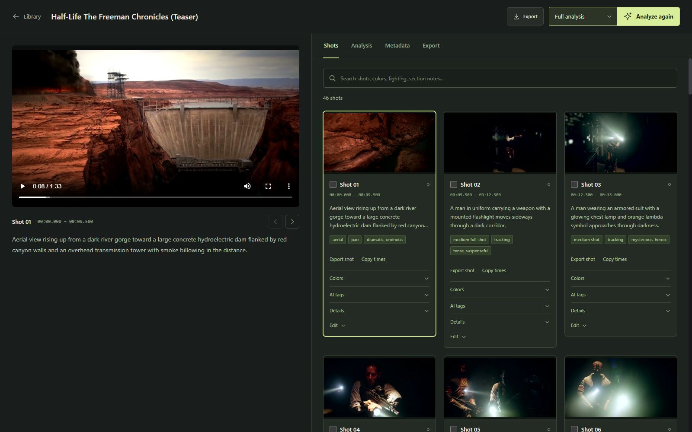
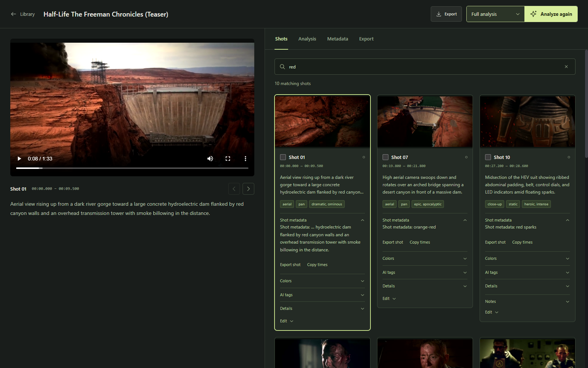
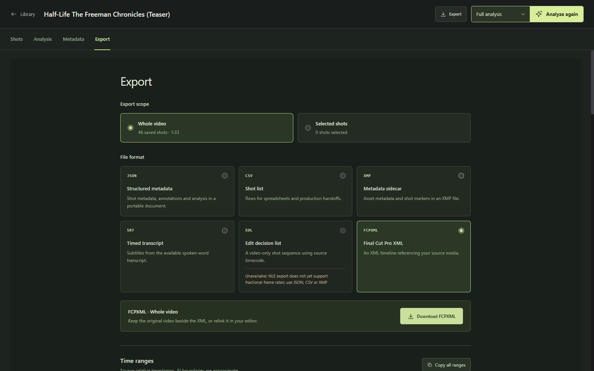

# Video Analyzer

Turn footage into a searchable shot library with Gemini analysis, editable metadata, and exports for the edit. Built for agency teams finding and reusing footage, and filmmakers exploring their material.



## From import to edit

1. **Import a video as its own project.** Preview and organize local footage without an AI key. Source facts, analysis, tags, notes, collections, and review decisions persist in SQLite across restarts.
2. **Choose Shots and tags or Full analysis.** Gemini describes shots, subjects, actions, colors, camera movement, and audio. Full analysis adds deeper cinematography, editing, narrative notes, and a video summary. Known-duration videos are processed in 30-second sections; shots and midpoint thumbnails appear as sections finish after provider upload processing.
3. **Find and review shots.** Search inside one project, play matching shots, edit human tags and notes, and record review and usage-rights status. Open an analysis section to jump back to its shots.
4. **Export the whole video or selected shots.** Download metadata and editorial interchange files, or copy individual in/out times and shot ranges.

Analysis runs in the background while the server is running, including when the browser tab closes. Partial results persist, duplicate runs are rejected, and interrupted runs are identified on restart. Retry is explicit; restarting the server does not automatically resume model calls.

## Search the details you remember

Search shot descriptions, colors, shot types, camera work, transcripts, section analysis, summaries, custom analysis, and human annotations. Results explain whether a match comes from the shot itself or from broader section/video context. Project, tag, review, collection, and rights filters help narrow the library.



Text search uses keywords over saved metadata and highlights matching words in shot details and source excerpts.

## Explore visual match cuts

Open **Match cuts** to connect shots through shape, composition, and color. Choose an outgoing frame, optionally select a region, and search the current project or selected projects. A persistent local index returns candidate frames with separate visual scores and outlined matching regions. Adjust both cut points, preview **A → B**, and export the pair's trim ranges as JSON.

Indexing publishes saved frames progressively, supports pause/resume, and makes no Gemini API calls. This first version uses contour and color measurements at five samples per shot. Motion scoring, learned visual embeddings, and frame-accurate NLE export of adjusted match pairs are future work. See [the workflow, implementation, and limits](docs/VISUAL_MATCH_CUTS.md).

## Export useful information

The dedicated Export screen supports the whole project or one or more selected shots. Available formats depend on the saved analysis and source timing; unavailable options explain what is missing.



| Format | Handoff |
|---|---|
| JSON | Structured metadata, annotations, analysis, and provenance |
| CSV | UTF-8 shot lists for spreadsheets and production handoffs |
| XMP | Metadata sidecars with timed shot markers |
| SRT | Subtitles from available timed transcript cues |
| EDL | Video-only edit lists with supported source timecode |
| Final Cut Pro XML | Shot sequences referencing the original media |

Exports preserve source coordinates and do not render or package video files. Selections from an older analysis are blocked until refreshed. See [accuracy and export boundaries](#accuracy-and-export-boundaries) for timing, subtitle, and editor compatibility details.

The original scene timeline, comparison, and report views remain available from **Analyzer**.

## Run locally

Requirements: Python 3.11+, Node.js 20.19+ or 22.12+, and ffmpeg/ffprobe on PATH.

### Windows PowerShell

```powershell
python -m venv .venv
.\.venv\Scripts\python.exe -m pip install -r backend/requirements.txt
npm --prefix frontend ci
npm --prefix frontend run build
.\.venv\Scripts\python.exe -m uvicorn app.main:app --app-dir backend --host 127.0.0.1 --port 8000
```

Open [the local workspace](http://127.0.0.1:8000). The backend serves the built frontend, so one server is enough.

### macOS / Linux

```bash
python3 -m venv .venv
.venv/bin/pip install -r backend/requirements.txt
npm --prefix frontend ci
npm --prefix frontend run build
.venv/bin/python -m uvicorn app.main:app --app-dir backend --host 127.0.0.1 --port 8000
```

For frontend development, run the backend on port 8000 and `npm --prefix frontend run dev` in another terminal. Vite proxies `/api` to the backend.

### Gemini configuration

Create an ignored `.env.local` or `.env` in the repository root (see `.env.example`):

```dotenv
GOOGLE_API_KEY=your-key-here
GEMINI_ANALYSIS_MODEL=gemini-3.8-flash
GEMINI_DEEP_MODEL=gemini-3.8-flash
```

The model defaults were selected from official documentation current in September 2026. They are configurable because availability, pricing and quality change. Verify access and benchmark representative footage before bulk processing. Both presets initially use the same stable model; the full preset performs more analysis passes.

Restart the backend after changing `.env.local` or `.env`. Alternatively use **Workspace settings** to supply a personal key. Browser keys are saved in browser localStorage and transmitted in headers to this application's backend, which calls Google. They are not placed in analysis URLs or saved in the library database. Importing/organizing footage does not send it to Google; starting analysis does.

Both Gemini presets passed a live smoke test with the configured key on a synthetic six-second, two-shot clip. Both identified the two exact on-screen labels and produced no invented transcript for silent footage. This verifies API compatibility; representative agency/filmmaker accuracy and comparative model performance remain unbenchmarked. See `docs/VERIFICATION.md`.

### Docker

```bash
docker compose up --build
```

Open [the Docker workspace](http://localhost:5173). Compose binds to loopback and persists both the library database and media in separate volumes. Run one API worker for this local workspace.

## Storage and processing

| Item | Default location / behavior |
|---|---|
| Original videos and thumbnails | `backend/uploads/` (ignored by Git) |
| Library and analysis records | `backend/data/library.sqlite3` (ignored by Git) |
| Provider key | `.env.local` / `.env` or optional browser override; never in SQLite |
| Upload limit | 2,000 MiB per file; configurable via `MAX_FILE_SIZE_MB` |
| Analysis concurrency | Two jobs; configurable via `MAX_CONCURRENT_ANALYSES` |
| Google file retention | Expiring provider references are refreshed from local originals before analysis |
| Results | Durable after each processing section; partial shots are searchable and reviewable during analysis. Failed sections retain successful results and report incomplete coverage. |

`DATABASE_PATH` and `UPLOAD_DIR` can override storage locations. Back up both the database and originals; exports do not package video files. YouTube references support analysis but do not provide local technical metadata or a native preview; use a local original for reliable editorial handoffs.

Imports have independent project IDs and results in the same SQLite database, rather than separate database files. The optional **Project label** metadata field can group related imports for an agency; it does not merge their shot browsers.

## Accuracy and export boundaries

AI scene/shot boundaries are **approximate**. Sampling can miss short edits; decimal timestamps do not imply frame accuracy. Model confidence is an uncalibrated estimate, and visible branding does not establish usage rights. Speech text is model transcription with shot-level timing, not a verified word-aligned transcript. SRT export fails clearly when no actual timed transcript exists; it never turns shot descriptions into subtitles.

Progressive indexing still waits for Google's upload processing before the first section. Shots crossing processing boundaries may be split and are flagged for review. Retry currently reprocesses the run; it does not skip successful sections. See [progressive analysis](docs/PROGRESSIVE_ANALYSIS.md) for behavior and measured latency.

EDL requires verified integer source frame rate and embedded non-drop timecode. FCPXML supports integer and exact common fractional frame rates; when embedded timecode is absent, it explicitly uses the media file's zero origin. Import inspection verifies nominal frame cadence against packet presentation timestamps while retaining the independently measured average rate. Unknown or irregular timing stays unverified. FCPXML needs valid source dimensions and references the original filename relative to the exported XML; put the original beside the XML or relink in the editor. Drop-frame, variable-rate and unsupported source timing are rejected with a reason. Generated structures are tested, but round-trip behavior in installed editors remains unverified.

Selected-shot exports preserve original timestamps and annotations. JSON includes relevant section notes as section-wide context, excluding unrelated whole-video summaries and custom reports. Selected SRT retains complete overlapping transcript cues and their original times; it does not invent word alignment. Selections from an older analysis are blocked until refreshed. Rendering a selected portion into a new video file is future work.

Cost figures use recorded provider token usage and dated pricing where available. Thinking tokens are included; audio/context/cache/pricing differences can make an aggregate estimate incomplete. Unknown models are marked unpriced, not assigned a zero-dollar promise.

This release is a **single-user local workspace**. Shared agency deployment still needs authentication, tenant boundaries, permission checks, object storage, a separate durable worker queue, operational monitoring and audit trails. The research and roadmap specify those changes; do not expose the unauthenticated local API as a public service.

## Verification

```powershell
.\.venv\Scripts\python.exe -m pip install pytest httpx
.\.venv\Scripts\python.exe -m pytest backend/tests tests -q
npm --prefix frontend run build
npm --prefix frontend run lint
```

Tests exercise real ffmpeg import/probe/poster generation and range playback, durable storage, metadata validation, search/review behavior, job recovery, mocked analysis stages, timestamp validation, provenance and export formatting. A source corpus with human ground truth is still needed for model accuracy comparisons.

## Research and implementation decisions

Start with [the research brief](docs/research/README.md), then read:

- [Model landscape and architecture](docs/research/model-landscape.md)
- [Agency and filmmaker workflows / competitor analysis](docs/research/workflows-and-market.md)
- [Product roadmap and release gates](docs/ROADMAP.md)

The research compares Gemini, Twelve Labs, cloud indexers and open models, plus Premiere, Resolve, Final Cut, Frame.io, iconik and axle. It distinguishes vendor claims from verified capabilities and recommendations. No universal model winner is assumed.

## Stack

React 19 / TypeScript / Vite / Zustand; Python / FastAPI / Pydantic; SQLite; Google Gen AI SDK; ffmpeg / ffprobe. API docs are available at `/docs` while the server runs.
