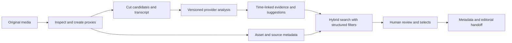

# Product roadmap and release gates

## Current rebuild

The existing per-video analyzer has become a local footage library. It supports persistent assets, batch local import, source inspection, posters/playback, scene and shot keyword search, human metadata/review, configurable Gemini analysis, durable stage results, job recovery and portable exports. Existing analyzer/comparison features remain reachable.

This is a usable single-user foundation. Its current search is keyword based, job execution is in-process, and the AI adapter has not been evaluated against this workspace's footage. The following work defines the path to an agency production service.

Progressive indexing now publishes shots and thumbnails after each 30-second processing section, with durable successful-section coverage and partial-result review. [Measured synthetic latency and remaining limits](PROGRESSIVE_ANALYSIS.md) include proxy ingestion, checkpoint-only retry, cross-section stitching, and bounded parallel processing.

## Next: benchmark recognition and retrieval

A valid Gemini project has passed a live synthetic smoke test of both presets. Next, run representative rights-cleared agency and filmmaking clips through every preset. Inspect the raw provider response, validate timestamps, compare visual text/logos/actions to source frames, inspect billable usage, and verify handling of long clips, silence, provider timeout and quota errors. A model being documented as available is not sufficient evidence that the user's key has access.

Build a labeled corpus with at least 50 varied clips and 100 editorial retrieval queries. Include fast montage and one-to-three-frame shots, source frame rates 23.976/24/25/29.97/30/50/59.94/60, variable frame rate, non-zero/drop-frame timecode, rotated phone video, long interviews, subtle brand appearances, onscreen text, speech overlap and silence. Record rights for all benchmark content.

| Measure | Proposed gate, subject to corpus agreement |
|---|---|
| Essential tag precision | At least 95% on human-reviewed key object/action tags |
| Unsupported factual claims | Under 2% of checked claims; report denominator and severity |
| Retrieval recall@10 | At least 90% on the held-out editorial query set |
| Temporal accuracy | Report median and 95th percentile start/end error and temporal IoU; never equate sampled timestamps to exact cuts |
| Review efficiency | At least 30% less time to a usable shot log than manual baseline |
| Cost and latency | Measure actual provider billable usage and p50/p95 completion time by clip length/preset |

These are proposed acceptance criteria, not measured product results. Test Gemini and Twelve Labs using the same corpus and budget assumptions. Use separate results for indexing, retrieval, transcript quality and generative answers.

## Next: editorial accuracy and portability

Add deterministic cut candidates with a tested scene detector, followed by local frame verification around transitions. Use a speech-recognition/alignment stage for word-level transcripts rather than relying on broad shot-level LLM text. Keep source-relative seconds, original timecode, rational frame rate, frame indices and confidence semantics explicit.

The export workspace now supports whole-project and selected-shot sidecars, plus exact fractional FCPXML timing. Add drop-frame and broader NLE adapters, then round-trip exports through installed versions of Premiere, Resolve and Final Cut Pro. Verify that media relinks, in/out ranges, source timecode, shot names, keywords and markers survive. Add actual clip rendering with optional handles and media/proxy packaging after source timing is reliable; metadata exports currently reference the original media.

Human corrections must never migrate silently to a different shot after re-analysis. Keep prior analysis versions and annotation snapshots; only reuse annotations when their source ranges match. A future schema should give each annotation a stable evidence identifier and distinguish edits to labels, source ranges and editorial decisions.

## Next: archive-scale search

An initial local visual match-cut index now supports shape, composition, and color, with region selection and A/B previews. It uses five samples per shot and classical contour/color measurements. Extend this with learned visual embeddings, denser boundary sampling, actual motion trajectories, and editor-labeled quality benchmarks before treating it as archive-scale match-cut retrieval. See [current implementation and limits](VISUAL_MATCH_CUTS.md).

Introduce a shot embedding pipeline and vector index with provider/version provenance, hybrid text/vector ranking and structured filters. Compare managed Twelve Labs search against owning embeddings and the retrieval index. Preserve full-text search for exact client names, text, dialogue, identifiers and tags; embeddings complement those fields.

Add query decomposition, evidence snippets, match ranges, retrieval explanations and relevance feedback. Measure false positives when queries combine action, object, camera movement, time of day, speech and rights status. Do not expose an uncalibrated similarity score as a probability of correctness.

Deduplicate imported material by content identity, handle source versions and proxy/original relationships, and provide resumable upload for large footage. Support thousands of assets with indexed database queries and paginated results rather than loading the whole library for every search.

## Next: shared agency deployment

Replace the local execution model with an authenticated service: workspaces/tenants, membership roles, project-level access, durable external queue, object storage, retry/idempotency contracts, audit events, lifecycle/retention policies and operational observability. Keep provider keys server-side under managed secrets. Enforce authorization on every media, metadata and export route.

Persist analysis runs independently of assets and stage artifacts, record provider request IDs and versions, keep usage budgets per job/project, and surface retry/cancel/partial states without re-billing completed stages unnecessarily. Add integrations to the specific storage/DAM tools the agency already uses after defining asset identity and synchronization ownership.

Track rights source documents, territory, media, dates, talent/music clearances and expiry as explicit reviewed records. Current unknown/cleared/restricted fields are a lightweight user-entered status; they do not replace a rights-management system.

## Architecture direction

Keep provider adapters below the application's asset, shot, evidence and annotation contracts. Switching models should create a new analysis version rather than rewrite editorial truth.
